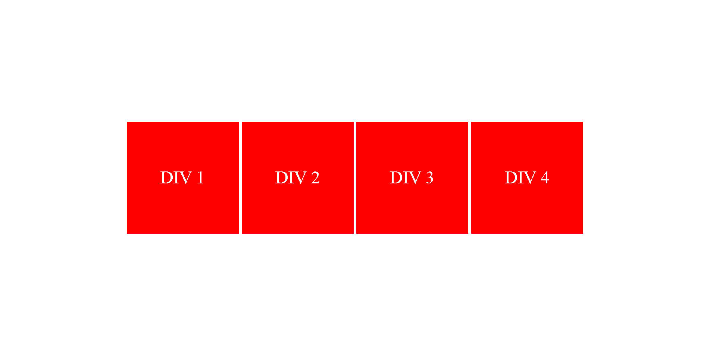
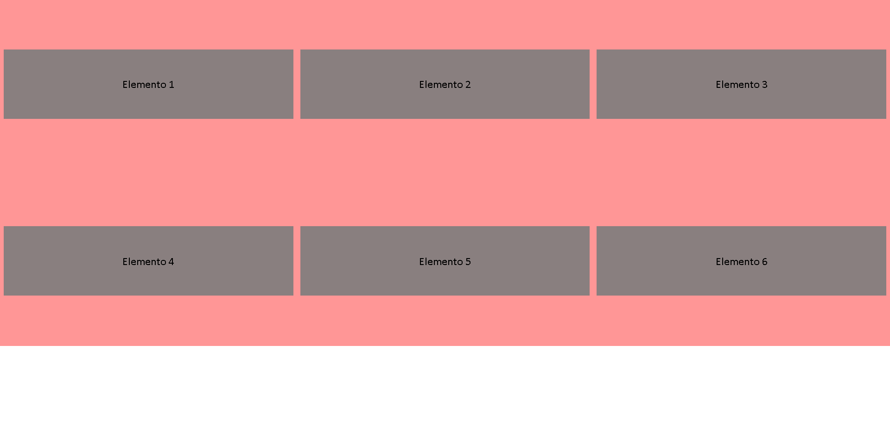
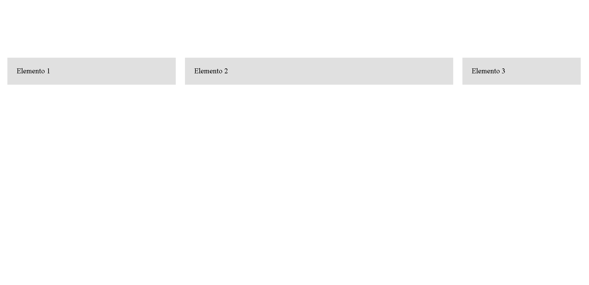

# Ejercicios de Flexbox

A continuación se presentan cinco ejercicios prácticos para practicar y repasar los conceptos de Flexbox. Estos ejercicios están diseñados para ayudar a los alumnos a familiarizarse con las propiedades y técnicas de Flexbox mientras construyen diseños flexibles y responsivos.

## Ejercicio 1: Alineación de elementos

- Crea un contenedor flex con cuatro elementos secundarios (divs) dentro.
- Aplica una alineación horizontal al contenedor para que los elementos secundarios se distribuyan equitativamente a lo largo del eje principal.
- Aplica una alineación vertical al contenedor para que los elementos secundarios se alineen al centro verticalmente.

## Ejercicio 2: Diseño de cuadrícula

- Crea un contenedor flex con varios elementos secundarios (divs) dentro.
- Configura el contenedor para que se comporte como una cuadrícula con tres columnas.
- Ajusta el espacio entre las columnas y las filas para que haya un margen uniforme alrededor de cada elemento secundario.

## Ejercicio 3: Diseño flexible

- Crea un contenedor flex con tres elementos secundarios (divs) dentro.
- Haz que el primer elemento secundario ocupe el 30% del ancho total del contenedor.
- Haz que el segundo elemento secundario ocupe el 50% del ancho total del contenedor.
- Haz que el tercer elemento secundario ocupe el 20% del ancho total del contenedor.

## Ejercicio 4: Orden de los elementos

- Crea un contenedor flex con cinco elementos secundarios (divs) dentro.
- Cambia el orden de los elementos secundarios de manera que aparezcan en un orden diferente al que están en el marcado HTML.