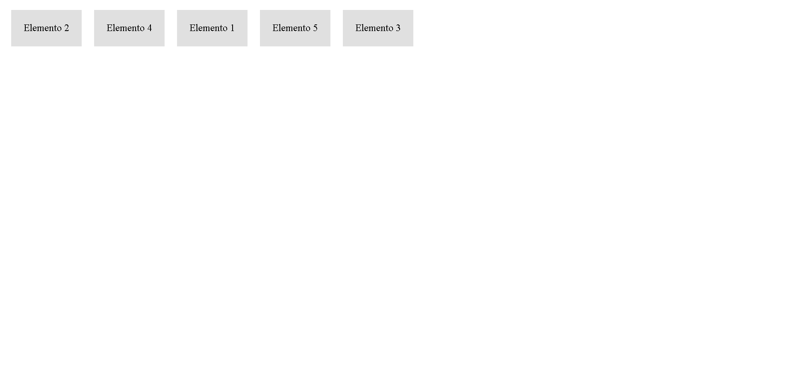

# Ejercicios de Flexbox

A continuación se presentan cinco ejercicios prácticos para practicar y repasar los conceptos de Flexbox. Estos ejercicios están diseñados para ayudar a los alumnos a familiarizarse con las propiedades y técnicas de Flexbox mientras construyen diseños flexibles y responsivos.

## Ejercicio 1: Alineación de elementos

- Crea un contenedor flex con cuatro elementos secundarios (divs) dentro.
- Aplica una alineación horizontal al contenedor para que los elementos secundarios se distribuyan equitativamente a lo largo del eje principal.
- Aplica una alineación vertical al contenedor para que los elementos secundarios se alineen al centro verticalmente.

## Ejercicio 2: Diseño de cuadrícula

- Crea un contenedor flex con varios elementos secundarios (divs) dentro.
- Configura el contenedor para que se comporte como una cuadrícula con tres columnas.
- Ajusta el espacio entre las columnas y las filas para que haya un margen uniforme alrededor de cada elemento secundario.

## Ejercicio 3: Diseño flexible

- Crea un contenedor flex con tres elementos secundarios (divs) dentro.
- Haz que el primer elemento secundario ocupe el 30% del ancho total del contenedor.
- Haz que el segundo elemento secundario ocupe el 50% del ancho total del contenedor.
- Haz que el tercer elemento secundario ocupe el 20% del ancho total del contenedor.

## Ejercicio 4: Orden de los elementos

- Crea un contenedor flex con cinco elementos secundarios (divs) dentro.
- Cambia el orden de los elementos secundarios de manera que aparezcan en un orden diferente al que están en el marcado HTML.

## Ejercicio 5: Diseño responsivo

- Crea un contenedor flex con dos elementos secundarios (divs) dentro.
- Configura el diseño para que los elementos secundarios se apilen verticalmente en pantallas pequeñas (menos de 768px de ancho) y se muestren en una fila en pantallas más grandes.
- Asegúrate de que los elementos secundarios se ajusten automáticamente al ancho del contenedor en ambos casos.

## Ejercicio 6: Diseño de galería de imágenes

- Crea un contenedor flex con varios elementos secundarios (divs) dentro.
- Configura el diseño para que los elementos secundarios se muestren en una cuadrícula de 3 columnas.
- Asegúrate de que los elementos secundarios tengan una altura fija y se ajusten automáticamente al ancho del contenedor.

## Ejercicio 7: Diseño de barra lateral y contenido principal

- Crea un contenedor principal que se divide en dos secciones: una barra lateral y un contenido principal.
- Configura el diseño para que la barra lateral ocupe un ancho fijo de 200px y el contenido principal ocupe el resto del espacio disponible.
- Ajusta el diseño para que la barra lateral se muestre a la izquierda y el contenido principal a la derecha.

¡Estos dos ejercicios adicionales permitirán a tus alumnos practicar y aplicar los conceptos de Flexbox en diferentes escenarios! Pueden personalizar los estilos y agregar contenido adicional según sea necesario.

¡Espero que tus alumnos disfruten de estos ejercicios adicionales! Si tienes más preguntas o necesitas más ejemplos, no dudes en hacerlas.

¡Diviértete practicando Flexbox con estos ejercicios! Recuerda que la experimentación y la modificación de los ejercicios pueden ayudar a los alumnos a comprender mejor los conceptos y técnicas de Flexbox.

Si necesitas más información sobre Flexbox, consulta la documentación oficial de CSS en [https://developer.mozilla.org/es/docs/Web/CSS/CSS_Flexible_Box_Layout](https://developer.mozilla.org/es/docs/Web/CSS/CSS_Flexible_Box_Layout).
